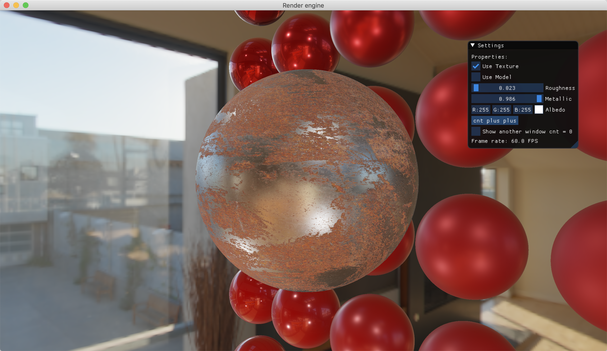

# Render-engine

A simple renderer.

## How to Build

To Build and run on *nix systems (macOS / Linux / FreeBSD):

```
mkdir cmake-Build
cd cmake-Build
cmake ..
make -j16
./engine
```

To Build on windows, see:

[Build for visual studio on windows](./doc/How-to-build-under-M$-Windows.md)

If you success, you will see something like these:





## Dependencies

- glm
- assimp
- glfw
- glad
- imgui
- stb_image

## Feature List:

- Cook-Torrance BRDF
- Basic transforms
- Camera and  interaction
- GUI

## TODO list:

- Scene graph
  - Acceleration data structure (BVH)
- External Scene description (with RapidJSON)
- External Material description (with RapidJSON)
- Better model loader (with Assimp)
- Shadow mapping (for point light and spot light)
- SSAO
- Bloom
- Cloth BRDF

